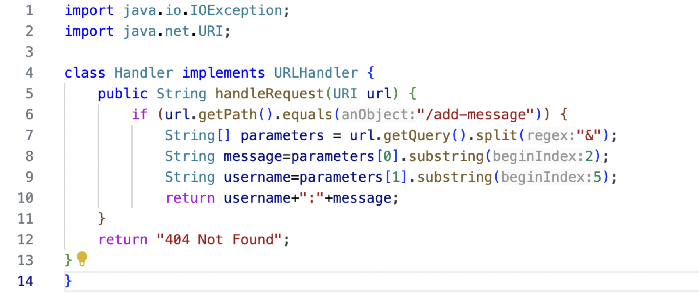
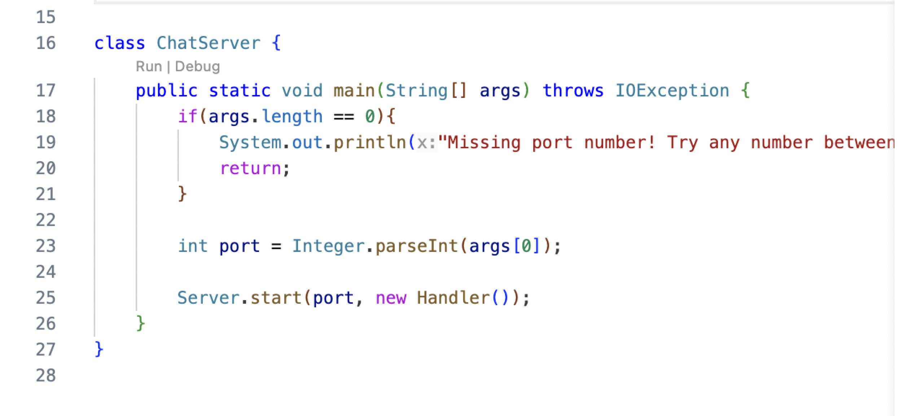
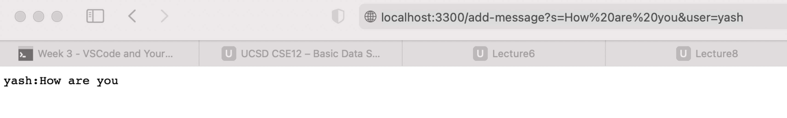

code:

using:

Question:
1. It called the method `handleRequest(URI url)` and `getPath()`
2. The only relevant argument of this method is `url`,and the value of the relevant field is 3300 which is the number of port.
3. This relevant field got no changes because 

