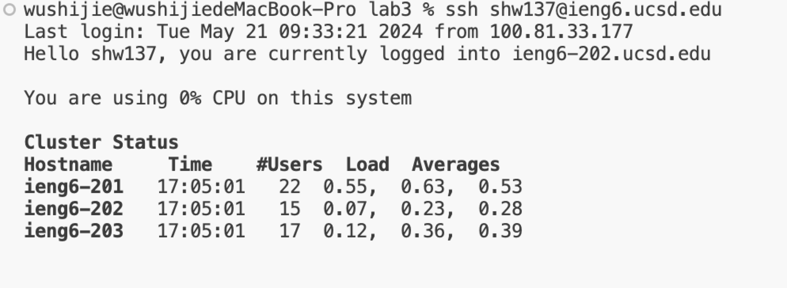
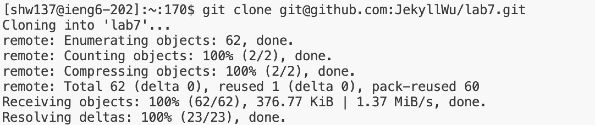
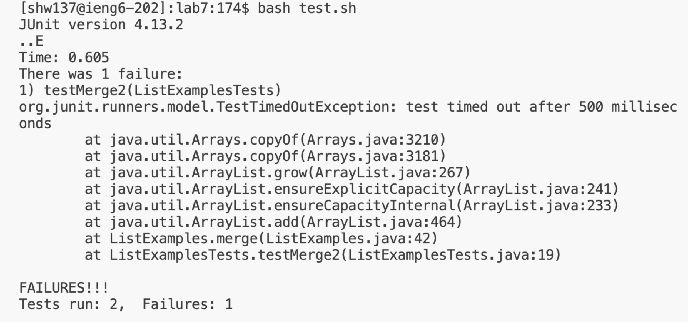
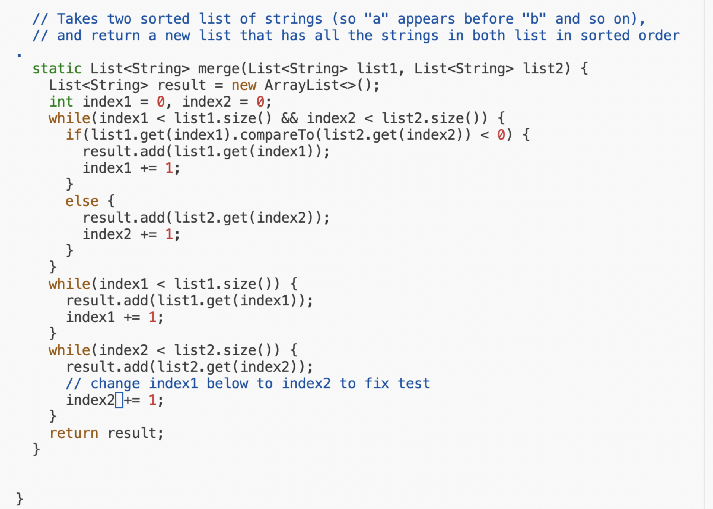
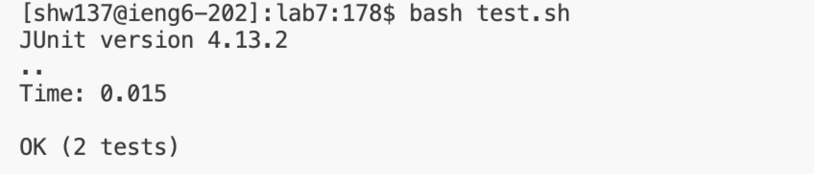
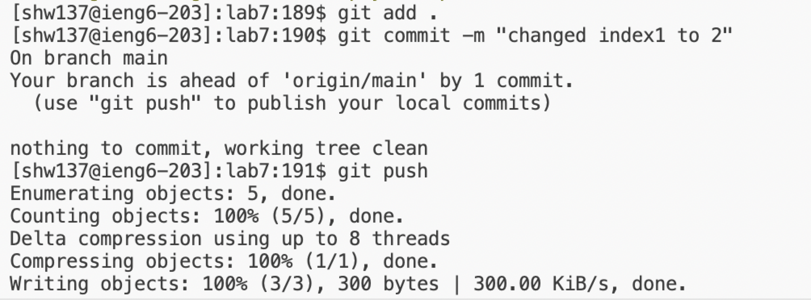

Step 4:

Keys I pressed: From the terminal, I typed in `ssh shw137@ieng6.ucsd.edu`(my username with `@ieng6.ucsd.edu` ), and then I pressed `return`.

summarize: From this step, I just typed in my username with `@ieng6.ucsd.edu` then return. Since before I stored my passcode in my local device, I do not have to typed in my passcode individually again.

Step 5:

Keys I pressed: From the terminal, I typed in `git clone git@github.com:JekyllWu/lab7.git`, then I pressed `return`.

summarize: From this step, I just typed in `git clone` following by `git@github.com:JekyllWu/lab7.git`. Since I stored my SSH key in my github account, I can use git clone with the SSH URL now.

Step 6:

Keys I pressed: From the terminal, I typed in `bash test.sh`, then I pressed `return`.

summarize: From this step, since the codes of `javac` and `java` are stored in `test.sh`, I do not have to type them again. Therefore, I could just run it with the command line `bash`.

Step 7:

Keys I pressed: From the terminal, I typed in `vim ListExamples.java`, then I kept holding `up` until I saw the line reaching 44, then I typed in `i`, then I kept holding `right` until my cursor reaching the space after the 1, then `delete`, then typed in 2. Lastly I pressed `esc` and typed in `:wq`.

summarize: From this step, firstly I have to get into the vim mode of ListExamples.java. They I used `up` and `right` to control my cursor going to the place I needed to fix. After I reached to the 1, I press`delete` to delete the 1 and put the 2 to complete the fix. Lastly, I press `esc` to quit the insert mode and typed in `:wq` to save my fix and quit the vim mode.

Step 8:

Keys I pressed: From the terminal, I typed in `bash test.sh`, then I pressed `return`.

summarize: Same as step 6, since the codes of `javac` and `java` are stored in `test.sh`, I can just run with the command line `bash`.

Step 9:

Keys I pressed: From the terminal, I typed in `git add .`, then `git commit -m "changed from index1 to 2"`, lastly I typed in `git push`.

summarize: From this step, I used `git add.` to stored the change. Then I used `git commit -m "changed from index1 to 2"` to leave the message. Lastly I used `git push` to upload the change.
