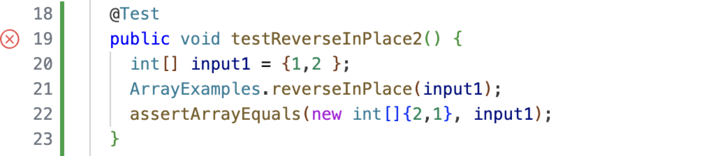
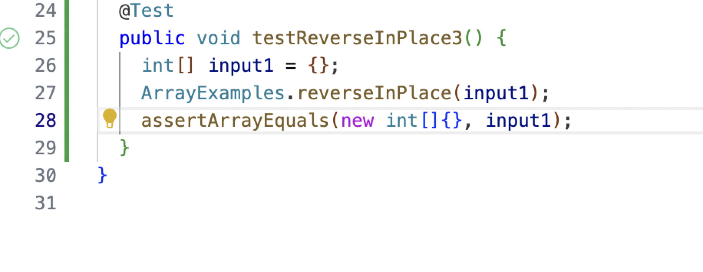
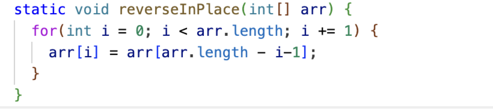
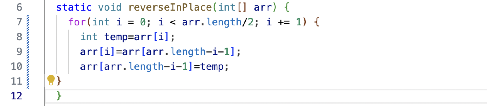

Part 1:
code:
Test with errors:
Test without errors:
Failure of test:
The code before fixed:
The code after fixed:
According to the original code, it sets the value of `arr[i]` to `arr[arr.length-i-1]` which is incorrect because as `i` exceeds `arr.length/2`, `arr[i]` would revert to its original value since we stored its original value in the first half of the array. Therefore, the solution would be to set `i` to be less than `arr.length/2` and create a new integer called `temp` to store the original value of `arr[i]`, then assign the value of `arr[i]` to be the value of `arr[arr.length-i-1]`, and lastly assign the value of `[arr.length-i-1]` to be the original value of `arr[i]`. This method can ensure each value would only be changed once and never revert to its original value.
