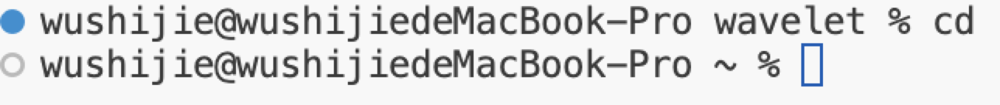
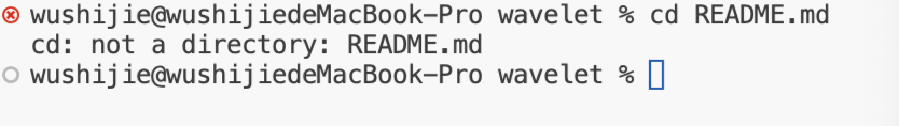
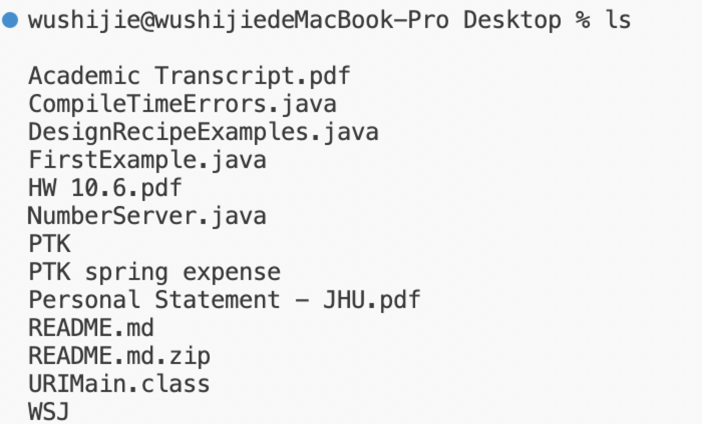
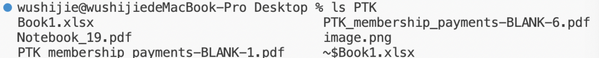
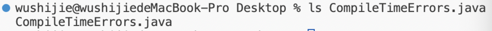
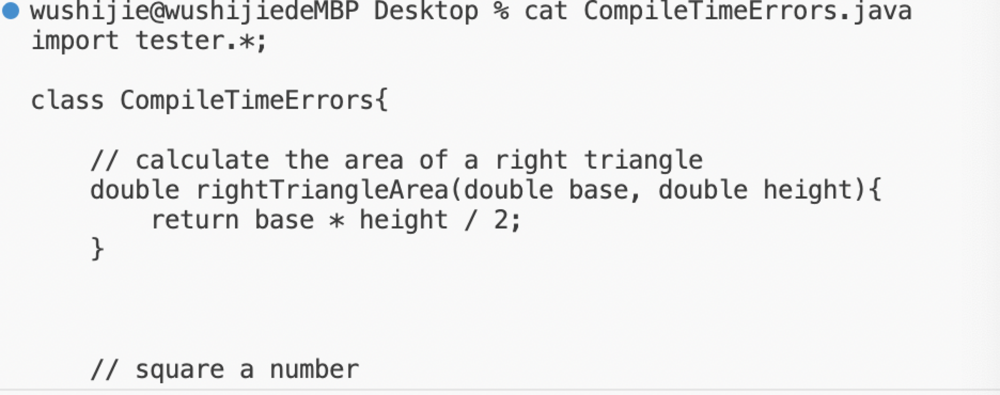

`cd`

Absolute path before: `wavelet`
With no arguments, it takes me to the home diretory.
no error.

`cd wavelet`

Absolute path before:`/Home`
Since there is a diretory as my argument, `cd` can bring me to the diretory.
no error.

`cd README.md`

Absolute path before:`wavelet`
With a file as an argument,it could causes an error because `cd` would takes us to diretories not files.

`ls`

Absolute path before:`Desktop`
Without any argument behind, `ls` just helps me list all files in the current diretory. That's why it lists all files in my Desktop.

`ls PTK`

Absolute path before:`Desktop`
With an argument `PTK`, `ls` helps me list all files and folders in the diretory PTK.

`ls CompileTimeErrors.java`

Absolute path before:`Desktop`
With an argument `CompileTimeErrors.java`. `ls` helps me list the file itself without errors.

`cat`

Absolute path before:`Desktop`
When I tried to do cat without any arguments, it broke down because `cat` is intended to print out the content in the file, and there are no files there. 

`cat PTK/`

Absolute path before:`Desktop`
When I tried to do cat with a directory as argument, it shows that there are some errors because PTK is an directory and `cat` is intended to work with files.

`cat CompileTimeErrors.java `

Absolute path before:`Desktop`
When I tried to do `cat` with a file as argument, it printed out the content inside the file with no errors.
