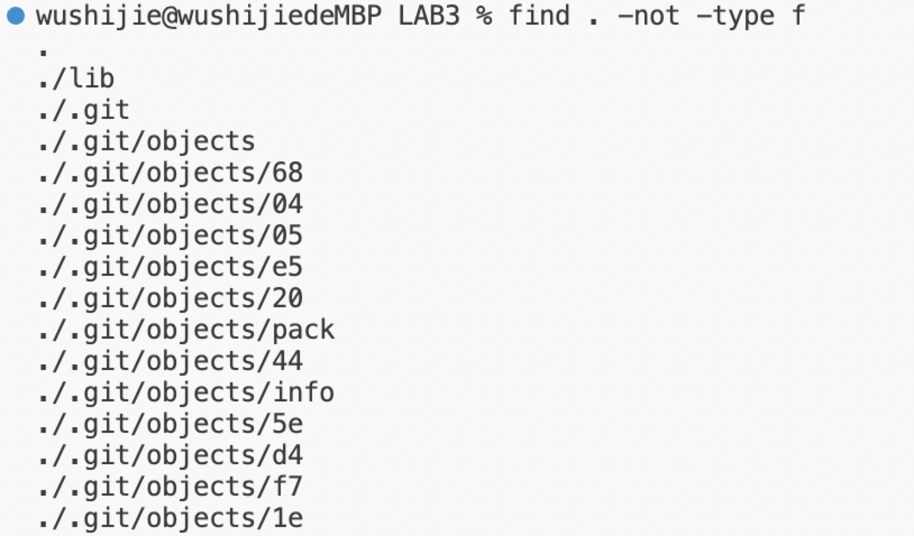

Part 1:
Test with errors:
`  @Test
public void testReverseInPlace2() {
     int[] input1 = {1,2 };
       ArrayExamples.reverseInPlace(input1);
    assertArrayEquals(new int[]{2,1}, input1);
	 }`

Test without errors:
`  @Test
 public void testReverseInPlace3() {
     int[] input1 = {};
       ArrayExamples.reverseInPlace(input1);
    assertArrayEquals(new int[]{}, input1);
	}`

Failure of test:

The code before fixed:
`static void reverseInPlace(int[] arr){
for(int i=0;i<arr.length;i+=1){
arr[i]=arr[arr.length-i-1];
}
}`

The code after fixed:
`  static void reverseInPlace(int[] arr) {
    for(int i = 0; i < arr.length/2; i += 1) {
      int temp=arr[i];
      arr[i]=arr[arr.length-i-1];
      arr[arr.length-i-1]=temp;
  }
  }`

According to the original code, it sets the value of `arr[i]` to `arr[arr.length-i-1]` which is incorrect because as `i` exceeds `arr.length/2`, `arr[i]` would revert to its original value since we stored its original value in the first half of the array. Therefore, the solution would be to set `i` to be less than `arr.length/2` and create a new integer called `temp` to store the original value of `arr[i]`, then assign the value of `arr[i]` to be the value of `arr[arr.length-i-1]`, and lastly assign the value of `[arr.length-i-1]` to be the original value of `arr[i]`. This method can ensure each value would only be changed once and never revert to its original value.

Part 2:
I would choose the command-line `find`:

Option 1:`-type`
By this command-line, we can search for all the contents with a specific type.

Example1: 

I searched it by type and the outputs are all files in the current directory. This is useful because sometimes we do not want to search everything in the directory, instead we only need a specific type of files.

Example2:

As above, I search it by type and it shows all the directories in the current directory. For same reason, it is useful because sometimes we only need to search something from directories instead of everyting in the directory.

Option 2: `-size`
With this option, we could also search our targets by its size.

Example1:

Here, I search files by there size and see if there are any files with the size 3K(there are no files in the current directory). It is useful because in some cases we may know the approximate size of a file, then if we need to search it we only need to set the size as a variable and find the target file from the output with a size in the range.

Example2:

Here, I am just doing the same thing from the example above. I am just searching files with the size 25M and I got nothing because there are no files in this directory with the size 25K.

Option3:`-iname`
This command-line works similarly to the command-line `-name`. The difference is that this command-line can ignore cases of letters.

Example1:

Here, I am searching the file with the name `node.class` ignoring the cases of letters. It is useful because sometings we may forget the cases of letters of some files. With this command-line we could find them easier.

Example2:

I am just doing same thing as above. i am searching files with the name `fileexample`.java ignoring the cases.

Option4:`-not`
This command-line allows us to search files which do not met some certain conditions.

Example1:

Here, I am searching files that are not `java` files in the current directory. This is useful because with this command-line, we do not have to search from all the files in the directory, instead we can set some conditions and search from files do not met the conditions.

Example2:

I am doing the similar thing from Example1 here. I am searching files that are not files.
