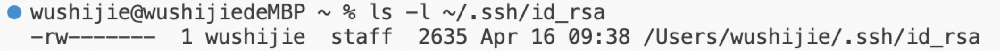
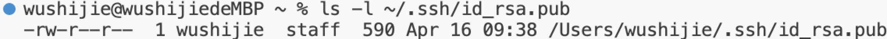

Part 1:
code:

using:

Question:
1. It called the methods `handleRequest(URI url)`, `display()`and `getPath()`.They are called to get the path and query, then display the chat history.
2. The relevant arguments of `handleRequest(URI url)` is `url`, It is where the path and query from. And a relevant field is `history` which is the list of the chat history.
3. Before the request, the relevant field `history` was empty, and afterward it became "jpolitz:Hello". The port number became 8889.

Question:
1. Same as before, the methods `handleRequest(URI url)`, `display()`and `getPath()` were called. They are called to get the path and query, then display the chat history.
2. Same as before, The relevant arguments of `handleRequest(URI url)` is `url`, It is where the path and query from. And a relevant field is `history` which is the list of the chat history.
3. Before the request, the relevant field `history` was "jpolitz:Hello", and afterward it became "jpolitz:Hello\n yash:How are you". The port number stayed same because we are still in the same port.

Part 2:

Part 3:
First of all, I am a beginner in computer science. I have never been exposed to this area before. The most shocking thing I have learned in the past two weeks is that we can connect  to an external computer to work. In the past, I always thought we could only use local computers. In addition, an new thing I learned is that we can use an git hub account to stored our work, which is very useful if we want to explore this area deeper.
