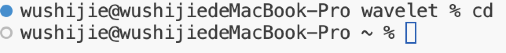
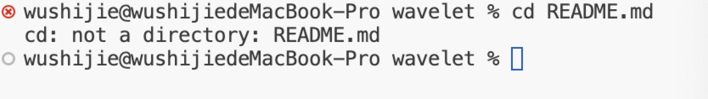

cd

Absolute path before: wavelet
With no arguments, it takes me to the home diretory.
no error.

cd wavelet

Absolute path before:Home
Since there is a diretory as my argument, cd can bring me to the diretory.
no error.

cd README.md

Absolute path before:wavelet
With a file as an argument,it could causes an error because cd would takes us to diretories not files.

ls

Absolute path before:Desktop
Without any argument behind, ls just helps me list all files in the current diretory. That's why it lists all files in my Desktop.

ls PTK

Absolute path before:Desktop
With an argument PTK, ls helps me list all files and folders in the diretory PTK.

ls CompileTimeErrors.java

Absolute path before:Desktop
With an argument CompileTimeErrors.java. ls helps me list the file itself without errors.

cat

Absolute path before:Desktop
When I tried to do cat without any arguments, it broke down because cat is intended to print out the content in the file, and there are no files there. 

cat PTK/

Absolute path before:Desktop
When I tried to do cat with a directory as argument, it shows that there are some errors because PTK is an directory and cat is intended to work with files.

cat CompileTimeErrors.java 

Absolute path before:Desktop
When I tried to do cat with a file as argument, it printed out the content inside the file with no errors.
